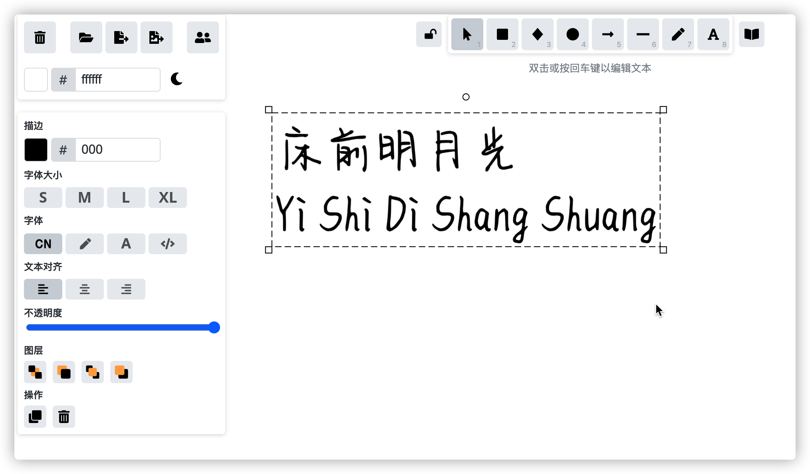

# Excalidraw

什么是 [Excalidraw](https://github.com/excalidraw/excalidraw) ?

本项目在 `Excalidraw` 的基础上支持了中文字体:

> [https://excalidraw.mebtte.com](https://excalidraw.mebtte.com/) 部署在 Github Pages, 中文字体偏大, 加载可能缓慢或者失败.

如果想更换字体, TTF 格式直接覆盖 `public/chinese.ttf`. 其他格式将字体文件放置 `public` 目录下, 然后将 `public/index.html`/`public/font.css` 中的 `chinese.ttf` 替换成新的字体文件名, 编译部署即可.
